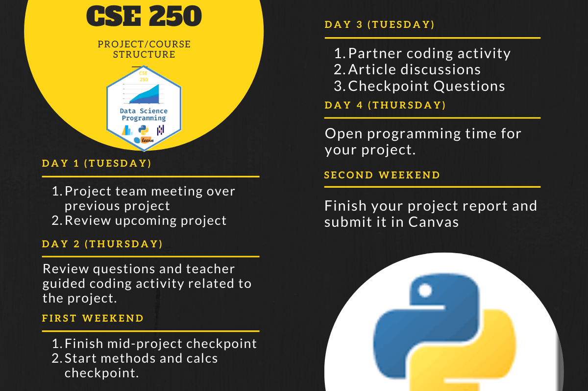



byuidss.slack.com





## My family

## My Education and Employment History

> - 2003: Undergraduate in Economics (er Socialist History) from the U.
> - 2003-2005: Master's degree in Statistics from BYU.
> - 2005-2015: [Pacific Northwest National Laboratory](https://www.pnnl.gov/computational-mathematics-statistics-0)
> - 2015-Current: [BYU-I](https://www.byui.edu/mathematics/our-faculty/j-hathaway)
> - 2015-Current: Data Driven Consulting (Child Health, Environmental Sampling, Business Consulting)
## My interests

> - [Data visualization and R](https://byuistats.github.io/M335)
> - [BYU-I Data Science Program](hhttps://web.archive.org/web/20200810102434/https://quanthub.com/data-science-church-of-jesus-christ-latter-day-saints/)
> - [Openness Theology](https://www.mostmovedmover.com/)
->  [Reading](https://www.goodreads.com/review/list/2791095-j?utf8=%E2%9C%93&shelf=read&per_page=100)

## [My learning manifesto](https://datathink.io/my-learning-manifesto-aka-teaching-philosophy/)

Will you take a minute and read my manifesto and then write one sentence, guessing what I expect from you in this class?

[Father Sarduci on Education](https://www.youtube.com/embed/kO8x8eoU3L4?rel=0&amp;start=0){target="blank"}





## A blend of programmer, statistician, and communicator that burns with curiosity.

What is this article saying about the data science skills that are needed?

_Find the table and text in the section above the table_

https://searchbusinessanalytics.techtarget.com/post/The-5-step-process-for-finding-data-science-leader-unicorns

> * [BYU-I Data Science](http://www.byui.edu/mathematics/data-science)





__Data scientists write code as a means to an end, whereas software developers write code to build things.__  Data science is inherently different from software development in that data science is an analytic activity, whereas software development has much more in common with traditional engineering.  Data scientists tackle problems such as identifying fraudulent transactions, or predicting which employees are likely to leave a company.  Software developers can take the data scientists models and turn them into fully functioning systems with production-quality code.  Software developers tackle problems like getting an algorithm to run more efficiently, or building user interfaces. 

More importantly than title, is that if you hire a data scientist and expect them to be a software developer, you are wasting a lot of your time and money.   If you hired a data scientist, put them to work identifying opportunities to use data science in your organization. [reference](https://thedataist.com/the-difference-between-software-development-and-data-science/)





## Course Outcomes

Upon completing this course, you will be able to use data-driven programming in __Python__ to handle, format, and visualize data. We will introduce you to data wrangling techniques (__panadas__), analytical methods (__scikit-learn__), and the grammar of graphics (__Altair__). Specifically, as a successful learner, you will be able to;

1. Use functions, data structures, and other programming constructs efficiently to process and find meaning in data.
2. Programmatically load data from various types of data sources, including files, databases, and remote services.
3. Use data manipulation libraries to perform straightforward analysis, produce charts, and prepare data for machine learning algorithms.
4. Use machine learning libraries to discover insights, make predictions, and interpret the success of these algorithms.
5. Use industry-leading tools to collaborate and share your work.

## Principles of DS teaching

The course follows these principles of teaching Data Science.

> - Organize the course around a set of diverse projects
> - Integrate computing into every aspect of the course
> - Teach abstraction, but minimize reliance on mathematical notation
> - Structure course activities to realistically mimic a data scientist's experience
> - Demonstrate the importance of critical thinking/skepticism through examples





One thing I learned from Dom is that nothing really matters unless you have __code__.

<iframe seamless="seamless" style="width: 100%; border: none; display: block; max-width: 768px; height: 600px;" src="https://getyarn.io/yarn-clip/embed/4ca85bda-8b8e-4c5a-bc3e-71c68e8e2cd2?autoplay=false"> </iframe>

## Tell me which driver you want to be?

You can't just be good with the tools of highly skilled and artistic users.  You need to put in the time.

<iframe width="560" height="315" src="https://www.youtube.com/embed/n6zWCwF298Y" frameborder="0" allow="accelerometer; autoplay; clipboard-write; encrypted-media; gyroscope; picture-in-picture" allowfullscreen></iframe>

## The history of the legend

> 1. [Math 335](https://byuistats.github.io/M335/) was the only new course we were allowed with the data science degree when we started in 2017. We had one class devoted to help our data science majors learn the art of data, data visualization, and data science programming.
> 2. __Math 335__ was my first course development, and I slightly forgot what ten years of experience provides.
> 3. Yes, __Math 335__ does require a lot of work.  But it has changed, and the students have changed with classes like CSE 150, CSE 250, and updates to Math 325, providing better preparation.

## The reality of CSE 250

> 1. We have done all we can to ensure that this is a 2-credit course for the average student.  That means that we expect 4-5 hours outside of class for the average student to achieve an A.  You have to put in the time if you want to build skills.
> 2. __The course is necessarily creative in nature.__ That fact usually makes it feel more challenging. We will be asking you to learn to write _creative_ data science python code.
> 4. __If you have any concerns, please talk with me.__





{}

The class uses 6 projects to teach data science programming in Python using [pandas](https://pandas.pydata.org/), [Altair](https://altair-viz.github.io/), [scikit-learn](https://scikit-learn.org/stable/), and [numpy](https://numpy.org/) (listed in order of use within the class).

- [Projects](../../../projects)

{}





- [Specification Grading](../../../course-materials/syllabus/#spec)
- [Grading structure](../../../course-materials/syllabus/competency/#scale)
- [Competency Elements](../../../course-materials/syllabus/competency/#elements)





Have the __[Introduction Project](../../../projects/introduction/)__ completed.

> You have your VS Code setup and ready for data science programming. Packages installed and you have recreated one Altair chart.


