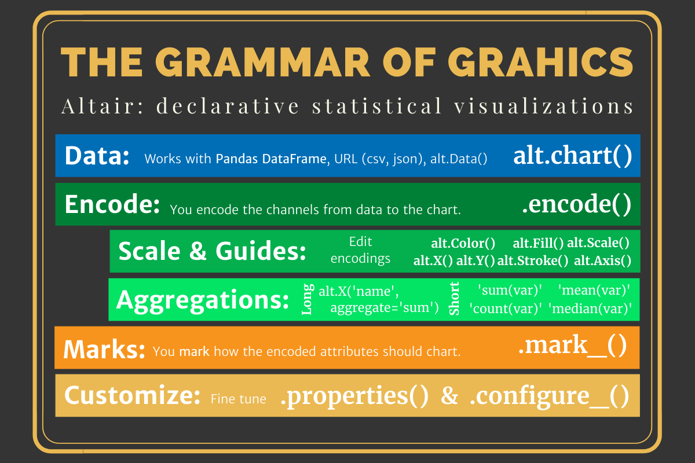

## A few questions




## It is built on the VEGA and D3 which are fast and web based.

<iframe width="560" height="315" src="https://www.youtube.com/embed/AAuPPorsmJc" frameborder="0" allow="accelerometer; autoplay; clipboard-write; encrypted-media; gyroscope; picture-in-picture" allowfullscreen></iframe>

## Grammar of Graphics: Vega-Lite



> - [Technical Paper](https://www.domoritz.de/papers/2017-VegaLite-InfoVis.pdf)
> - [Website](https://vega.github.io/vega-lite/)
> - [Endorsment](https://medium.com/@robin.linacre/why-im-backing-vega-lite-as-our-default-tool-for-data-visualisation-51c20970df39)






## Indexing, `.loc[]` and `.iloc[]`

I may not be experienced enough to understand why I should teach you these. I think they all add complexity to what we are learning in the course and we have elected to avoid it.  We will use `reset_index()` a lot.  I think [MultiIndex](https://towardsdatascience.com/how-to-use-multiindex-in-pandas-to-level-up-your-analysis-aeac7f451fce) features create complication. I have also elected to use `.filter()` instead of `.loc[]` because I like it.

## Virtual Environments

[Virtual Environments](https://towardsdatascience.com/virtual-environments-for-data-science-running-python-and-jupyter-with-pipenv-c6cb6c44a405#:~:text=The%20primary%20purpose%20of%20Python,dependencies%20every%20other%20project%20has.) appear to be an important tool as you continue to use Python.  We will not be teaching these or supporting these in our course.

## matplotlib (and any tool leveraging it)

It feels old, [has a bad api](https://ryxcommar.com/2020/04/11/why-you-hate-matplotlib/), and isn't declarative.





> Because learning new tools is almost always confusing.  I want to make sure you don't drown, but I also don't want you to think that you get a floaty for the rest of your life. 





## Class Activity

Try to do each questions before looking at the information within the question drop down.

### Get your files and folders setup to start working on the project.



- `data_science_programming > birth_names >`    
    - `names.py`   
    - `names.md`
    - `notes.md`
    - `data.csv` _(just in case the internet is down)_

__Create the folder and files to get prepared.__






__I would do this process for every project.__

#### names.py

Every file starts with the same cells 1) import packages, 2) load data.

#### names.md

Let's start with the [course template](../../template/cse250_project_template.md)

```md
# Project Document Title

__<Author Name>__

## Elevator pitch

## TECHNICAL DETAILS

### GRAND QUESTION 1

### GRAND QUESTION 2

### GRAND QUESTION 3

...

## APPENDIX A (PYTHON SCRIPT)

```

#### notes.md

I would copy over the project information and then keep notes on the readings in that section.




### Discovering a new data relationship.



We have a row for each name-year.  Excluding the name and year columns we have a column for each state and DC. Finally there is a Total column that sums over the other columns.

> - __If you can't describe what a row is in your table then you don't understand what groups you can talk about with your data.__
> - __The columns tell you what information you will be able to evaluate on each 'group' or 'observation' in your data.__

 __We want [tidy data](https://byuidatascience.github.io/python4ds/tidy-data.html).__






> 1. pull the name column out as a series
> 2. Use the pandas unique function `pd.unique()`
> 3. find the size of the series

<!-- pd.unique(dat.name).size -->

<iframe src="https://beepmyclock.com/widget/timer" frameborder="0" style="border:0;height:175px;"></iframe>






> 1. write a query that filters to your name
> 2. pull the year column as a series
> 3. Find the max
> 4. Find the min
> 5. Find the number of unique years
> 6. Write a short sentence describing your results.

<!-- pd.unique(dat.query('name == "John"').year).min()
pd.unique(dat.query('name == "John"').year).max()
pd.unique(dat.query('name == "John"').year).size -->

> In addition to being a more efficient computation, compared to the masking expression this is much easier to read and understand. Note that the `query()` method also accepts the `@` flag to mark local variables:
> [jakedvp](https://jakevdp.github.io/PythonDataScienceHandbook/03.12-performance-eval-and-query.html)


<iframe src="https://beepmyclock.com/widget/timer" frameborder="0" style="border:0;height:175px;"></iframe>






> 1. Sum all the years for each name (`groupby()`).
> 2. Create a new DataFrame for the totals.
> 3. Write a query that filters the total data to the max and min.
> 4. Create a markdown table with the information.    
>     A. `to_markdown()` requires the `tabulate` package.    
>     B. `to_markdown()` with arguments `showindex` and `floatformat`    
>     C. [Guidance on `floatformat`](https://stackoverflow.com/questions/37079957/pythons-tabulate-number-of-decimal/37080063)    

<!-- dat_total = dat.groupby('name').agg(n = ('Total', 'sum')).reset_index()
print(dat_total
    .query('n in [@dat_total.n.max(), @dat_total.n.min()]')
    .to_markdown(showindex = False, floatfmt=".0f")) -->




