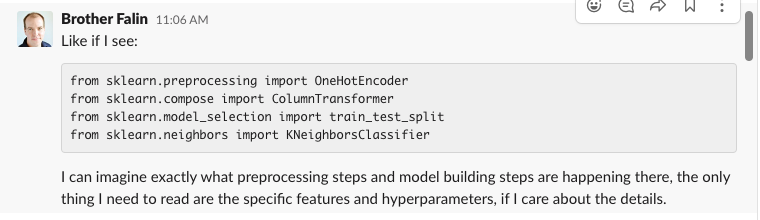
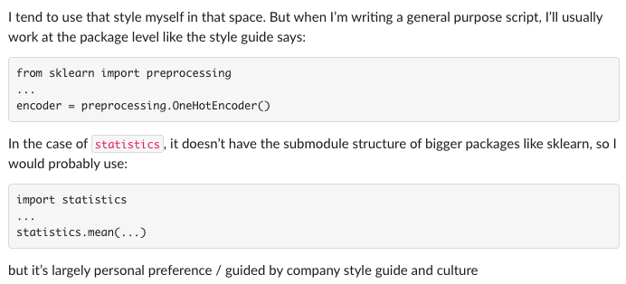

## What is scikit-learn?

[About scikit-learn](https://scikit-learn.org/stable/about.html) helps us see the history and funding.  It should stay king of the hill for a long time.

- Simple and efficient tools for predictive data analysis
- Accessible to everybody, and reusable in various contexts
- Built on NumPy, SciPy, and matplotlib
- Open source, commercially usable - BSD license




scikit-learn is very large, with many [submodules](https://scikit-learn.org/stable/user_guide.html).  To help the user of your `.py` script understand your code, the consensus is to use `from .... import ....`.






```python
from sklearn.model_selection import train_test_split
from sklearn import tree
from sklearn.naive_bayes import GaussianNB
from sklearn import metrics
```







```python
import pandas as pd 
import altair as alt
import numpy as np
import seaborn as sns
```






```python
dwellings_denver = pd.read_csv("https://github.com/byuidatascience/data4dwellings/raw/master/data-raw/dwellings_denver/dwellings_denver.csv")
dwellings_ml = pd.read_csv("https://github.com/byuidatascience/data4dwellings/raw/master/data-raw/dwellings_ml/dwellings_ml.csv")
dwellings_neighborhoods_ml = pd.read_csv("https://github.com/byuidatascience/data4dwellings/raw/master/data-raw/dwellings_neighborhoods_ml/dwellings_neighborhoods_ml.csv")   
```






[MaxRowsError: How can I plot Large Datasets?](https://altair-viz.github.io/user_guide/faq.html#maxrowserror-how-can-i-plot-large-datasets)

You may also save data to a local filesystem and reference the data by file path. Altair has a JSON data transformer that will do this transparently when enabled:

```python
alt.data_transformers.enable('json')
```






> - square footage
> - number of bathrooms
> - basement size

> Let's create one chart using some of these variables.







```python
X_train, X_test, y_train, y_test = train_test_split(
    X_pred, 
    y_pred, 
    test_size = .34, 
    random_state = 76)   
```

## Read the documentation and tell me what is returned?

__[Function documentation](https://scikit-learn.org/stable/modules/generated/sklearn.model_selection.train_test_split.html)__   


[Destructuring assignment](https://riptutorial.com/python/example/14981/destructuring-assignment)

### Why do we use `test_size` and `random_state`?

### What is `X_pred` and `y_pred`  in the above function example?

We need to take our data and build the feature and target data objects.

> What columns should we remove from our features (X)?   

> What column should we use as our target (y)?





```python
from sklearn import tree
```

### What method do we want from `tree`?

> - What is our target?   
> - Don't forget to set your arguments.   





> 1. fit
> 2. predict
> 3. evaluate metrics





__[How to evaluate your ML model](https://ranvir.xyz/blog/how-to-evaluate-your-machine-learning-model-like-a-pro-metrics/)__


### The confusion matrix

Take a second and write a short sentence describing where the model is doing well and where it might be falling short?

```python
print(metrics.confusion_matrix(y_test, predict_p))
metrics.plot_confusion_matrix(classifier, X_test, y_test)

```






> 1. Build a `pd.DataFrame({})` with the top 12 variables and their feature importance.   
> 2. Create a feature importance bar chart with the most important feature sorted to the top.



