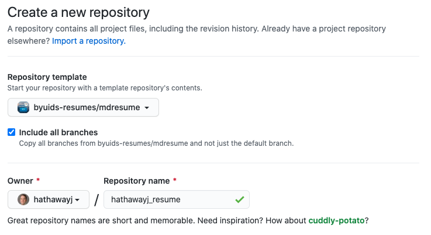

<!-- https://byuidss.herokuapp.com/ -->
<!-- https://byui-dss.herokuapp.com/ -->

## Questions about Project 5?

## Questions about Project 6?

__Read the project overview and Questions for understanding.__

- [Our 2-week project details](..)
- Questions?

## Let's get git

###  Just make sure you realize that GitHub is key to your employment

> This is GitHub, the world’s largest code repository platform online. A platform used by some 50 million software developers to host their coding projects, most of them open-source — meaning others can access their codes and modify them to create better versions if they feel like.

> Most of the internet is produced or hosted on GitHub in the form of code. “What Gmail is to email, GitHub is to writing software,” says Kiran Jonnalagadda, cofounder of HasGeek, a platform to build and discover peer groups.

Read more at:
https://economictimes.indiatimes.com/internet/inside-github-web-developers-social-media-platform/articleshow/77096752.cms?utm_source=contentofinterest&utm_medium=text&utm_campaign=cppst

#### Don't post assignments

#### Do post unique code using skills from your classes

#### Use private repos with [student education account](ttps://education.github.com/students) to manage your course work

### Is it going to hurt?

__Yes.__

It feels weird at first but quickly becomes second nature. FWIW, Math 335/CSE 350 students are required to submit all coursework via GitHub. This is a major topic in class and office hours for the first two weeks. Then we practically never discuss it again.

More bad news. The Math 335/CSE 350 pain is short-lived because students primarily work in their own repositories. Do you use GitHub to work with other people or to coordinate your own work from multiple computers? If so, after you recover from the initial setup, Git will crush you again with merge conflicts. And this is not one-time pain, this could be a dull ache for a long time. The best remedy is prevention, but also understanding how to back out of tricky situations and tackle them on your own terms.

Managing a project via Git/GitHub is much more like the Google Doc scenario and enjoys many of the same advantages. It is definitely more complicated than collaborating on a Google Doc, but this puts you in the right mindset.

[ref](https://happygitwithr.com/big-picture.html)

### Download and install

1. Download [git](https://git-scm.com/downloads).
2. Make sure git is working on your computer (https://git-scm.com/) 
    A. [Mac fix with paths](https://modulesunraveled.com/installing-git/updating-git-if-you-have-only-version-comes-xcode-or-command-line-developer-tools)    
    B. [Download Xcode and update](https://developer.apple.com/xcode/) 10 gig download.   
    C. [VSCode path selection](../../course-materials/git_github_ds/) 

### Use the resume template in your repo

- Join the organization using the link provided in Slack.
- Get connected to our GitHub organization - [byuids-resumes](https://github.com/byuids-resumes)

### The Git workflow

[Analytics Vidhya reading](https://www.analyticsvidhya.com/blog/2020/05/git-github-essential-guide-beginners/)

#### Let's clone using VS Code

#### Let's push using VS Code

__We have to set some configurations.__

1. Open the Terminal in VS Code.
2. Set your username: `git config --global user.name "FIRST_NAME LAST_NAME"`
3. Set your email address: `git config --global user.email "MY_NAME@example.com"`

