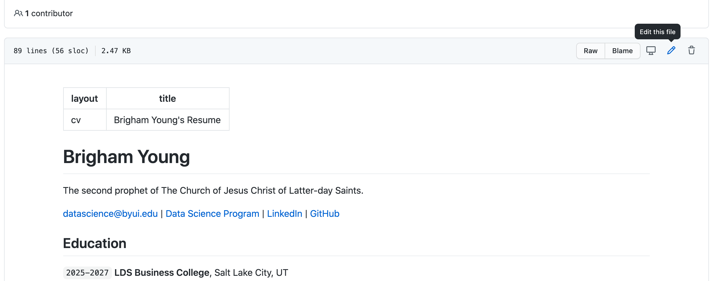
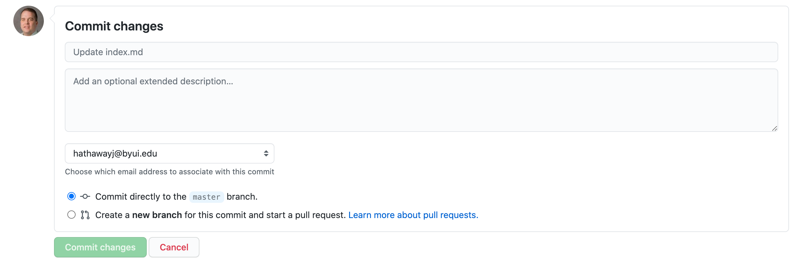

## Practie with `add, commit, push` and a little `pull`

1. Let's start by editing our `index.md` file on Github. Simply go to `docs/index.md` and fix the name and Education portion in Github

2. After you make your edits, then use the web UI to commit them.

3. Now, we have a different version on GitHub than we do on our local repository. We need to `git pull`

4. Instead of working on GitHub, let's use VSCode to make additional edits to our resume.

5. Once you have some edits done, let's sync them with GitHub. We can use commands or VSCode.   

   A. ` git add --all`: Is telling git that which files you want to store in this _'memory'_.   
   B. ` git commit -m 'my message'`: Is telling git to label all the files that have been added with the message and prep them for _'lift-off'_.   
   C. `git push`: sends the files to the cloud.   

__That is the flow!__

## What the fork?

Now is time for you to find a partner that will edit your resume.  You are going to want to keep the same partner.

1. Each of you `fork` the other student's repository that has edits.
2. Now, you want to clone that forked repository to your computer.
3. On your local version of the forked repository, do the following;   
   A. Create a new file called `edits.md` and save it in the main folder or the repository.   
   B. Make a few recommendations or notes about what each of you discussed about your resumes in the file.   
   C. `add, commit, push` your edits.   
   D. Go to the forked repo on GitHub and check to see if the `edits.md` file is in yours.   
4. Now, create a `pull request` to get your edits into your partner's original repo.

## On Data Science Resumes

> [byuidatascience.github.io](https://byuidatascience.github.io/resume_example.html)   
> [undergraduate ds resumes](https://byuidatascience.github.io)   
> [Hathaway's resume](http://jhathaway.io/extra/hathaway.pdf)   

