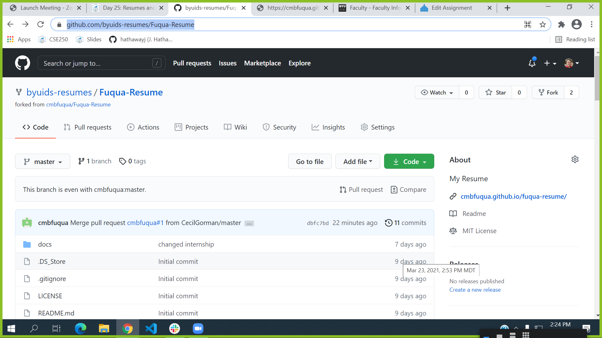

## Forking back into [BYUI Data Science Resumes](https://github.com/byuids-resumes)

Make sure your final resume is submitted to Canvas.

1. A finalized resume that renders as a website in the /docs folder.

2. An updated link in the About that navigates to your GitHub pages resume.

3. A comment on your assignment in Canvas describing the quality of your resume.

A link to your forked repo in byuids-resumes with the About link linking back to your github.io based on your repo. For example, Ben Fuqua has forked his repo (https://github.com/byuids-resumes/Fuqua-Resume).  Notice in the picture below that his link on the about section links to his github.io page not byuids-resumes io page.

